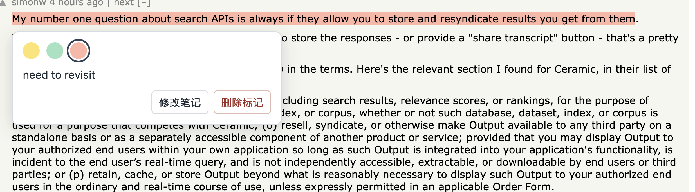

# light-bulb - 临时阅读标记

一个用于阅读的 Chrome 扩展，可随手标记网页重点并记下你的想法。

Vibe with Copilot

# What it looks like

## Load in Chrome

1. Open `chrome://extensions`.
2. Turn on **Developer mode**.
3. Choose **Load unpacked** and select this folder.
4. Reload any open documentation page and select text. Choose a fill style, optionally enter a note, then click a color to apply the highlight immediately. Hover over a highlight to read or edit its note, change its color, or delete the mark.

Click the extension icon to open the dashboard, where highlights are grouped by page URL and notes can be edited or deleted. Highlights and notes are stored locally by page URL. The extension requests access to HTTP and HTTPS pages so its selection toolbar can run on documentation sites.